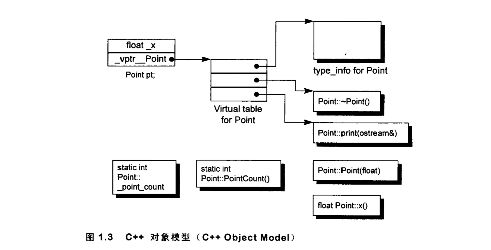
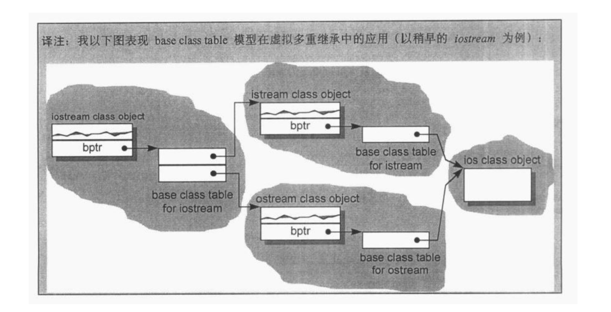

## Chartp1 关于对象

C++在布局以及存取时间上的主要额外负担是由virtual引起，包括：
-	virtual function机制，用以支持一个有效率的"执行期绑定"
-	virtual base class，用以实现"多次出现在继承体系中的base class，有一个单一而被共享的实体"

#### C++对象模型
Static和 nostatic function members放在所有的class object之外， virtual function通过两个步骤支持：
1. 每个class产生一堆指向virtual function的指针，放在表格之中，这个表格称为virtual table。
2. 每个class object被添加一个指针，指向相关的virtual table, 通常这个指针被称为vptr。每个class 
所关联的type_info object（用以只是RTTI）也经由virtual table指出，通常放在表格的第一个slot。

###### 加上继承
一个derived class如何在本质上模塑其base class实体了？
在base table模型中，这里base class table被产生出来时，表格中每个slot包含一个相关的base class地址，
每个class object内部包含一个bptr，它会被初始化，指向其base class table。

