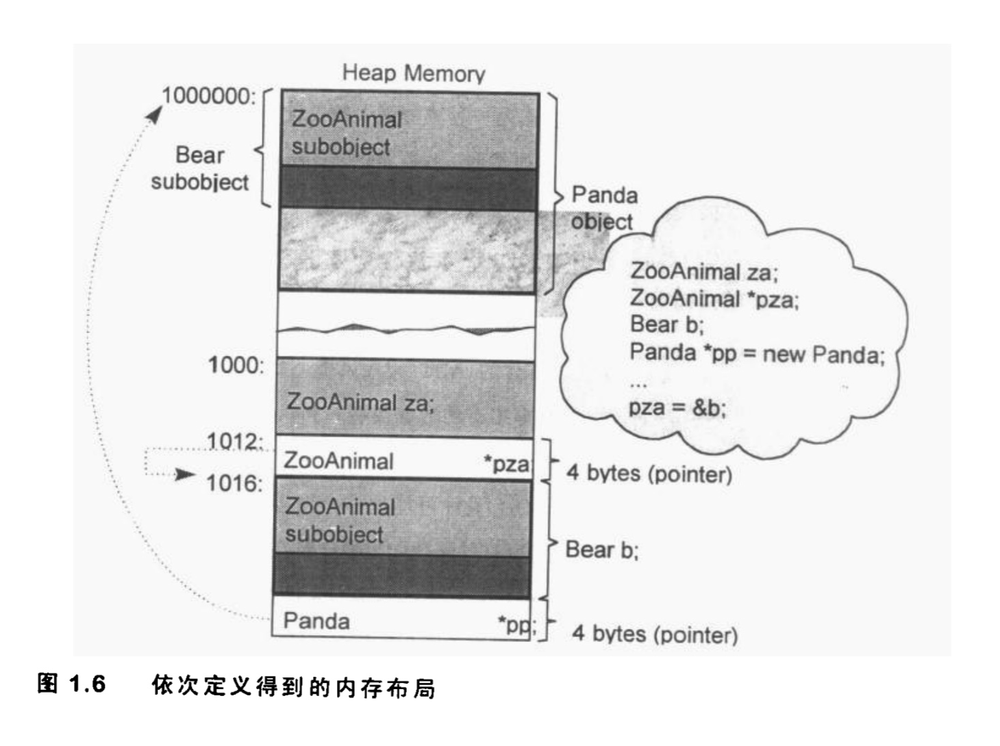

## Chartp1 关于对象

C++在布局以及存取时间上的主要额外负担是由virtual引起，包括：
-	virtual function机制，用以支持一个有效率的"执行期绑定"
-	virtual base class，用以实现"多次出现在继承体系中的base class，有一个单一而被共享的实体"

#### C++对象模型
Static和 nostatic function members放在所有的class object之外， virtual function通过两个步骤支持：
1. 每个class产生一堆指向virtual function的指针，放在表格之中，这个表格称为virtual table。
2. 每个class object被添加一个指针，指向相关的virtual table, 通常这个指针被称为vptr。每个class 
所关联的type_info object（用以只是RTTI）也经由virtual table指出，通常放在表格的第一个slot。


###### 加上继承
一个derived class如何在本质上模塑其base class实体了？
在base table模型中，这里base class table被产生出来时，表格中每个slot包含一个相关的base class地址，
每个class object内部包含一个bptr，它会被初始化，指向其base class table。


C++中凡是处于同一个`access section`的数据，必定保证其声明次序出现在内存布局中，然而放置在多个`access section`的各笔数据，排列次序就不一定了。

```c++
class stumble {
public:
	// operation
protected:
	// protected stuff
private:
	char buff[];
};
```
同样的道理，base chass和derived class的data mmebers的布局也没有谁先谁后的强制规定，因而也不能保证前述的C伎俩一定有效。

### 对象的差异

C++程序的设计模型支持三种：
1. 程序模型(procedural model)
2. 抽象数据模型(abstruct data type model, ADT)
3. 面向对象模型(object-oriented model)。此模型中有一些彼此相关的类型，通过一个抽象的base class被封装起来。


```c++
class ZooAnimal {
public:
	ZooAnimal();
	virtual ~ZooAnimal();
	virtual void rotate();

protected:
	int loc;
	string name;
};

// Case 0
ZooAnimal za("Zoey");
ZooAnimal *pza = &za;


class Bear: public ZooAnimal {
public:
	Bear();
	~Bear();
	void rotate();
	virtual void dance();

protected:
	enum Dances { A, B};
	Dances dance_know;
	int cell_block;
};

// Case 1
Bear b("Yogi");
Bear* pb = &b;
Bear& rb = *pb;

// Case 2
Bear b;
ZooAnimal* pz = &b;
Bear* pb = &b;

pz->cell_block; // ERROR
((Bear*)pz)->cell_block; // OK, down_cast操作

if (Bear* pb2 = dynamic_cast<Bear*>(pz))
	pb2->cell_block; // OK(run-time operation)

pb->cell_block; // OK
```


当我们写pz->rotate()时，会在编译期决定以下两点。
1) 固定的可用接口。也就是说，pz只能够调用ZooAnimal的public接口。
2) 该接口的`access level`（例如rotate()是ZooAnimal的一个public member
