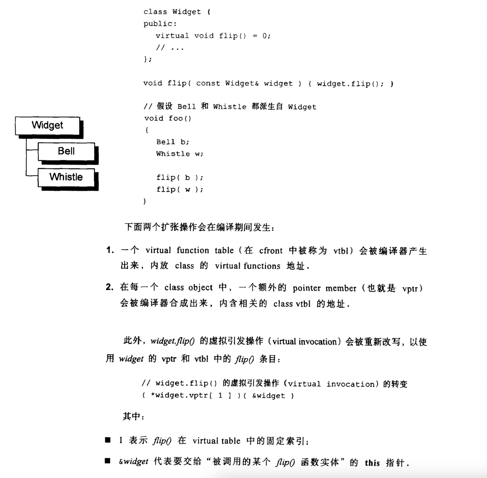
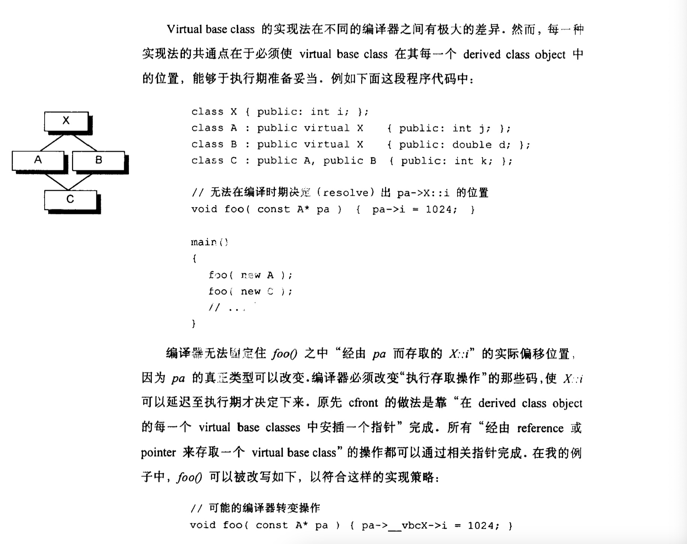

## 构造函数语意学

ARM => C++ Annotated Reference Manual

C++ Standard在Section 12.1说
>	对于class X，如果没有任何user-declared constructor，那么会有一个default constructor被暗中(implicitly)声明出来，它将是一个trivial(没啥用的)constructor。


```c++
class Foo {
public:
	int val;
	Foo *next;
};

void foo_bar() {
	Foo bar;  // 程序要求bar的data members都初始化为0
	if (bar.val || bar.next) {
		// do something
	}
}
```

什么时候才会合成一个default constructor呢？当编译器需要它的时候！此外合成出来的constructor只执行编译器所需要的行动。也就是说，即使有需要为class Foo合成一个default constructor，那个constructor也不会将两个data members 初始化为0。

### Nontrivaial default constructor

Nontrivaial default constructor在ARM的术语中就是编译器所需要的哪种，必要的化会由编译器合成。

a) 带有default constructor的member class object
如果一个class没有任何constructor，但它有一个member object，而后者有default constructor，那么这个implicit default constructor即是"nontrivial"。

如果有多个class member objects都要求constructor初始化操作，将如何呢？C++语言要求以member objects在class中的声明次序来调用各个constructors，这一点由编译器完成，它为每一个constructor安插程序代码，以“members声明次序”调用每一个member所关联的default constructors。


b) 带有default constructor的base class
类似的道理，如果没有任何一个construct 的class派生自一个“带有default constructor“的base class，那么这个derived class的default constructor会被视为nontrivial。


c）带有virtual function的class
class声明（或继承）一个virtual function



d) 带有virtual base class的class



### copy constructor的构建操作


三种情况：
```c++
class X { ... };

X x;

X xx = x; // case 1：以一个object的内容作为另一个class object的初值


extern void foo(X x);

X xx;
foo(xx); // case 2：参数


X foo_bar() {
	X xx;
	return xx; // case 3：返回值
}

```

一个良好的编译器可以为大部分class object产生bitwise copies，因为它们有bitwise coy semantics语义。

向default  constructor一样，如果class没有声明一个copy constructor，就会隐含的声明或隐含的定义出现。和以前一样，copy constructor也分为trival和nontrival两种，区别是class是否展现出所谓的'bitwise copy constructor'。


#### bitwise copy semantics（位逐次拷贝）

```c++
class Word { // bitwise copy semantics（位逐次拷贝）语义
public:
	Word(const char*);
	~Word( {delete [] str;}
private:
	int cnt;
	char* str;
};

class Word {
public:
	Word(const String&);
	~Word();

private:
	int cnt;
	String str;
};

其中String声明一个explicit copy constructor：
class String {
public:
	String(const char*);
	String(const String&);
	~String();
};
```
## 不要BitWise Coy Semantics

什么时候不展现"bitwise copy semantics呢？存在四种情况：

1. class含有member object，后者声明一个copy constructor（无论是被明确声明或者被合成)
2. class继承一个base class，后者存在copy constructor（无论是被明确声明或者被合成）
3. class声明一个或多个virtual functions
4. class派生自一个继承链，其中有一个或多个virtual base class
其中1、2两种情况中，编译器必须将member或者base class的'copy constructor'调用操作安插到被合成的conpy constructor中。


### 重新设定virtual table指针（情况3）

编译期间程序扩张操作：
1. 增加一个virtual function table(vtbl)，内含每一个有作用的virtual function地址
2. 将一个virtual function table的指针(vptr)安插在class object内部

### 处理virtual base class subobject（情况4）

virtual base class的存在需要特殊处理。
