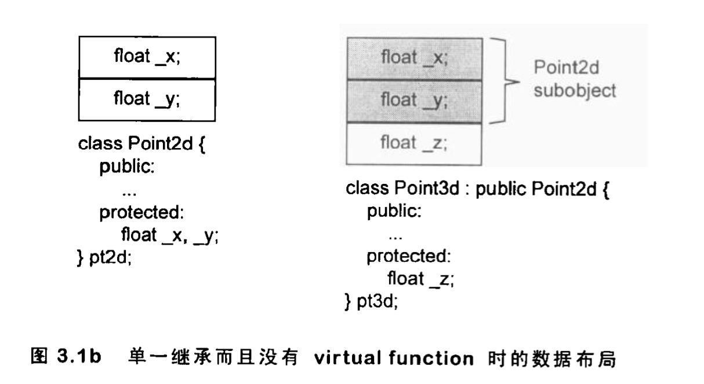
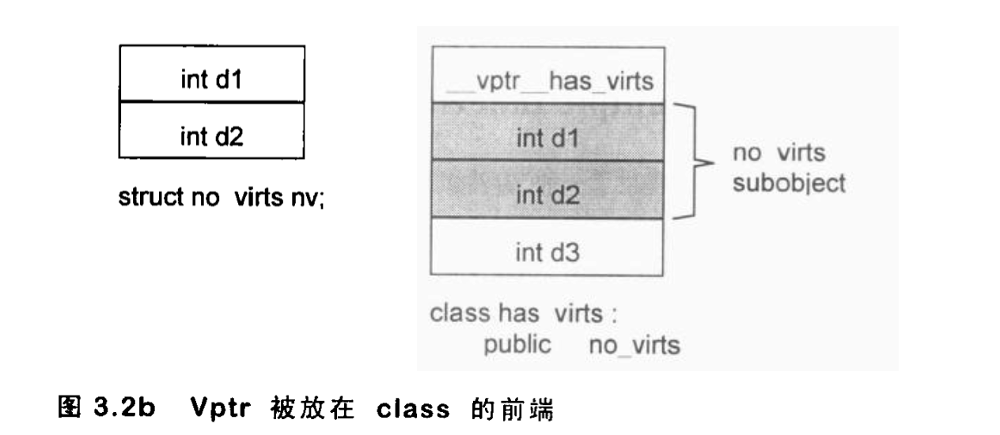

## Data 语意学
一个空的class如：
```c++
// sizeof X == 1
class X {};
```
事实上，X并不是空的，它有一个隐晦的1 byte，那是编译器安插进去的一个char，这使得这个class的两个objects得以在内存配置独一无二的内存地址：
```c++
X a, b;
if (&a == &b) {
    cerr < "yipes!" << endl;
}
```

但是Y和Z的sizeof结果却是：
```c++
// sizeof Y == sizeof Z == 8
class Y: public virtual X {};
class Z: public virtual X {};
class A: public Y, public Z {};
```
事实上，Y、Z的大小受到三个因素影响：
1. 语言本身所造成的额外负担（overhead)
2. 编译器对特殊情况所提供的优化处理。
3. Alignment限制，class Y和Z大小截止目前为5 byte（32位？）大部分机器上会受到alignment限制

那么你期望A的大小是什么？
如果我们忘记Y、Z都是“虚拟派生”自class X，我们可能回答16。毕竟Y和Z的大小都是8。然而我们对class A施以sizeof 运算符，得到的答案竟然是12。

记住一个virtual base class subject只会在derived class中存在一分实体，不管它在继承体系中出现了多少次，class A的大小由以下几点决定：
1. 被大家贡献的唯一一个class X实体，大小1 byte
2. Base class Y的大小，减去“因 virtual base class X而配置”的大小，结果是4 bytes（说的是没有对sizeof(X) = 1, sizeof(Y) = 1 + 4 = 5(alignment = 8)的情况）
3. class A自己的大小: 0 bytes
4. class A的alignment，调整前是1 + 4 + 4 = 9, alignment = 8

如果我们考虑那种“特别对empty virtual base class做了处理”的编译器，一如前所述，class X实体的那1 byte会被拿掉，于是额外的3 bytes填补也不必了，因此class A的大小是 8 bytes。

### Data Member的绑定
```c++
extern float x;
class Point3d {
public:
    Point3d(float, float, float);
    float X() const { return x; }
    void X(float new_x) const { x = new_x };
private:
    float x, y, z;
};

```
Point3d::X()到底会传回class内部那个x，还是外部的那个x？
C++ Standard以"member scope resolution rules"规定。效果是：

```c++
extern int x;
class Point3d {
    float X() const { return x; };
};

// 事实上，分析在这里进行。

```
对member function本身的分析，会直到整个class声明都出现了才开始。

然而，反对对于member function的argument list并不为真，Argument list中的名称还是会在它们第一次遭遇时被释放的决议（resolve)完成，因此在extern 和 nested type names之间的非直觉绑定操作还会发生。

```c++
typedef int length;
class Point3d {
public:
    void mumble (length val) { _val = val; }
    length mumble() { return _val; }
private:
    // legnth必须在"本class对它第一参考操作”之前被看见
    // 这样的声明将使之前的参考操作不合法
    typedef float length;
    length _val;
};
```
上述情况任然需要某种防御性程序风格：请使用把"nested type"声明放在class起始处。

### Data Memeber 的布局
已知下面一组data members:
```c++
class Point3d {
public:
    // ...
private:
    float x;
    static List<Point3d*> *freeList;
    float y;
    static const int chunkSize = 250;
    float z;
};

```

static data member存放在程序的data segment 中，和个别的class object无关。

C++ Standard要求，在同一个access section中，member的排列只需符合“较晚出现的members在class object中有较高的地址”这一条件极客。也就是，各个member并不一定要连续排列。

编译器还会合成一些内部使用的data members，以支持整个对象模型，vptr就是这样的东西。vptr会放在什么位置呢？传统上它被放在所有明确声明的members最后。不过当前也有一些编译器把vptr放在class object最前端。

### Data Member的存取

#### Static Data Members
Static data members，按照其字面意义，被编译器提出于class之外，视为一个global变量。
每一个static data member只有一个实体，存放在程序的data segment之中，每次程序参阅（取用）static member就会被内部转化为对该唯一extern实体的直接参考操作：
```c++
// origin.chunkSize = 250
Point3d::chunkSize == 250；

// pt->chunkSize = 250;
Point3d::chunkSize = 250;
```

#### Nonstatic Data Members
Nonstatic data members直接存放在每一个class object之中，除非经由明确或暗喻的class object，没有办法直接存取它们。只要程序员在一个member function中直接处理一个nonstatic data member，所谓的"implicit class object"就会发生。
```c++
Point3d
Point3d::translate(const Point3d& pt) {
    x += pt.x;
    y += pt.y;
    z += pt.z;
}
// 实际上被转化为
Point3d
Point3d::translate(Point3d* const this, const Point3d &pt) {
    this->x += pt.x;
    this->y += pt.y;
    this->z += pt.z;
}
``` 对一个nonstatic data member进行存取操作，编译器需要把class object的起始地址加上data member的偏移量（offset），例如，
```c++
origin._y = 0.0;
// &origin._y的地址为
&origin + (&Point3d::_y - 1);


// 下面两种情况的差异：
origin.x = 0.0;
pt->x = 0.0;
```
从origin存取和从ptr存取的差异？当Point3d是一个derived class，而在继承结构中有一个virtual base clas，并且存取的member是一个从该virtual base class继承而来的member时，就会有重大差异。

因为我们不能够说pt必然指向哪一种class type（因此编译器时不知道member真正的offet位置），所以这个存取操作必须延迟到执行期间，经由一个外的间接引导，才能够解决。而origin就没有这个问题，其类型无疑是Point3d class，即使继承自virtual base class，member的offset位置在编译期间就能够确定。

#### 继承与Data Member

依次讨论：单一继承且不含virtual funtion、单一继承含virtual function、多重继承、虚拟继承四种情况。

#### a)只要继承不要多态
```c++
class A1 {
public:
    // ...
private:
    int val;
    char bit1;
};

class A2: public A1 {
public: 
    // ...
private:
    char bit2;
};

class A3: public A2 {
public: 
    // ...
private:
    char bit3;
};

// sizeof(A1) = 8
// sizeof(A2) = 12
// sizeof(A3) = 16
```
把两个原本独立不相干的class凑成一对"type/subtype"，并带有继承关系，会有什么易犯的错误呢？
经验不足的人可能会重复设计一些相同操作的函数。
第二个易犯的错误是，把一个class分解成两层或更多层，有可能为了”表现class体系之抽象化“而膨胀所需空间。C++语言保证：”出现derived class中的base class subobject有其完整原样性“

#### b)加上多态

如果我们要处理一个坐标点，而不在乎它是什么Point2d或者Point3d实例，我们需要提供一个virtual function接口。

在C++编译器领域有一个讨论题目：把vptr放置在class object的哪里会更好？

把vptr放在class object的尾端，可以保留base class C struct的对象布局，因为允许在C程序中也能使用。

把vptr放在class object的前端，对于”在多重继承之下，通过指向class members的指针调用virtual function"，会带来一些帮助。否则，不仅”从class object起点开始量起“的offset必须在执行期备妥，甚至于class vptr之间的offset也必须备妥，当然，vptr放在前端，代价就是丧失了C语言兼容性。但是，这种丧失有多少意义？有多少程序会从一个C struct派生出一个具有多态性质的class呢？

#### c) 多重继承


如图3.1b、图3.2a或图3.3。
你会看到base class和derived calss的objects都是从相同地址开始，其差异在于derived object比较大，用以多容纳它自己的nonstatic data members。
```c++
Point3d p3d;
Point2d *p = &p3d;
```
把一个derived calss object指定给base class的指针或引用，该操作不需要编译器去调停或修改地址，它很自然的发生，而且提供最佳的执行效率。


图3.2b把vptr放在class object起始处，如果base class没有virtual function，而derived calss有，那么单一继承的自然多态就会被打破，这种情况下，把一个derived object转换成其base类型，就需要编译器介入，用以调整地址。

```c++
class Point2d {
public:
    // ...
protected:
    float _x, _y;
};

class Point3d: public Point2d {
public:
    // ...
protected:
    float _z;
};

class Vertex {
public:
    // ... 注意有virtual 接口，所以有vptr
protected:
    Vertex* next;
};

class Vertex3d: public Point3d, public Vertex {
public: 
    // ...
protected:
    float mumble;
};
```
多重继承的问题主要发生于derived class object和其第二或后继base class objects之间的转换；


