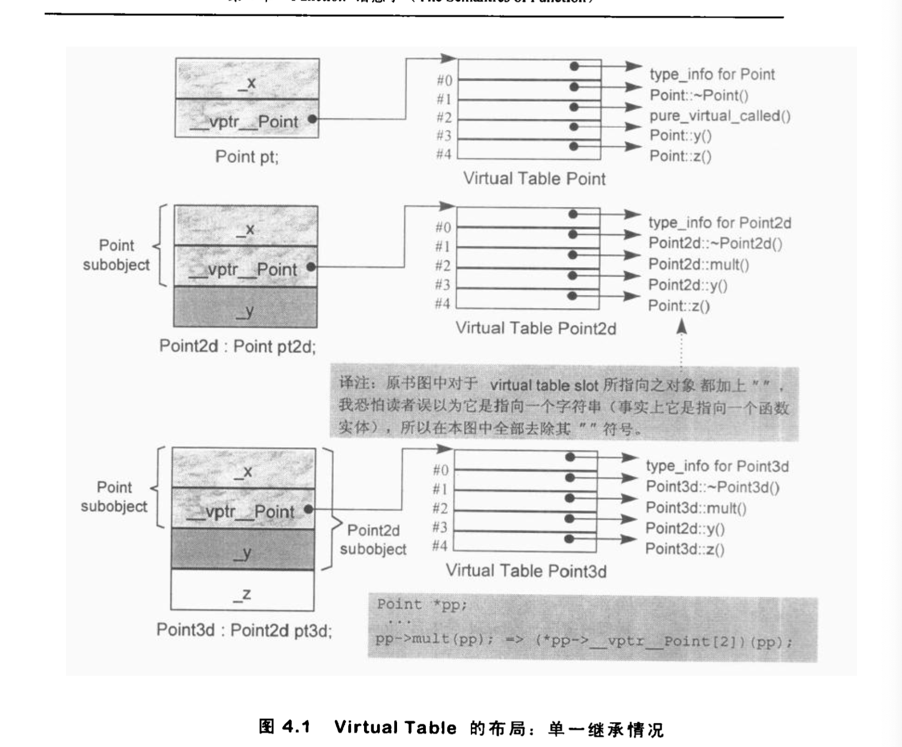
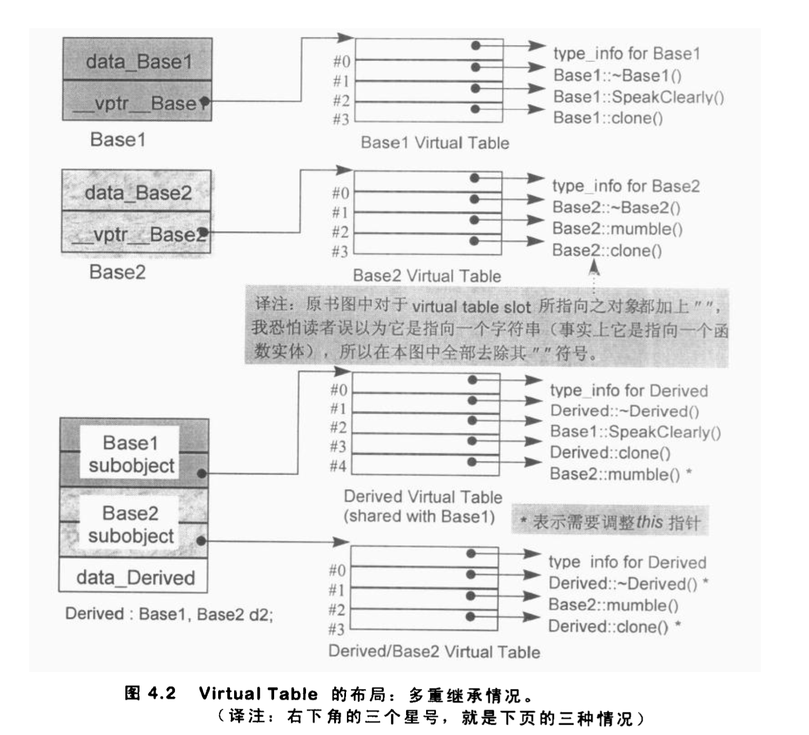
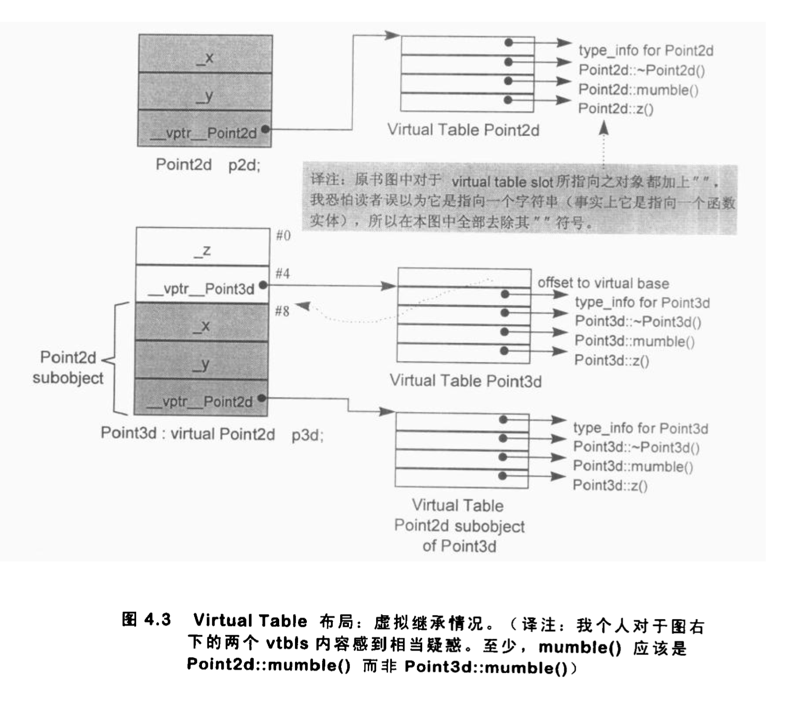
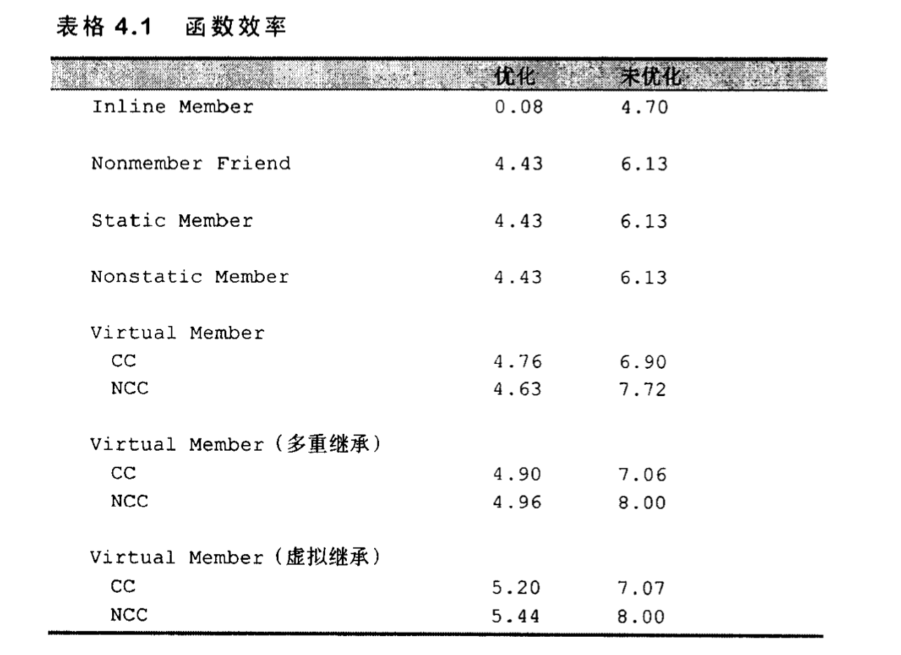

## Function 语意学

```c++
Point3d Point3d::normalize() const {
    register float mag = magnitude();
    Point3d normal;
    
    normal._x = _x / mag;
    normal._y = _y / mag;
    normal._z = _z / mag;
    return normal;
}
```
C++支持三种类型member function: static、nonstatic和virtual，每一种类型被调用的方式都不相同，其中有两个原因：1）直接存取nonstatic 数据 2）它被声明为const。使得，static member function不可能做到这两点。

原始的”C with Classes“只支持nonstatic member functions。Virtual 函数在20世纪80年代中期被加进来，并且受到许多质疑。Static member functions是最后被引入的一种函数类型，在1987年Useix C++研讨会的厂商研习营中被正式提议加入C++中，并由cfront2.0实现出来。

#### Nonstatic  Memeber Function（非静态成员函数）
C++设计准则之一就是：nonstatic member function至少和一般的nonmember function有相同的效率。也就是，如果在以下两个函数之间做选择：
```c++
float magnitude3d(const Point3d* _this) { ... }
float Point3d::magnitude3d() const { ... }
```
那么选择member function不应该带来什么额外负担，这是因为编译器内部已经将”member函数实体“转换为对等的”nonmember函数实体“
```c++
// magnitude()的一个nonmember 定义：
flaot magnitude3d(const Point3d* _this) {
    return sqrt(_this->_x * _this->_x + 
                _this->_y * _this->_y + 
                _this->_z * _this->_z);
}
```
乍看之下似乎nonmember function比较没有效率，它间接地有参数取用坐标成员，而member function是直接取用坐标成员。然而，它实际上member function被内化为nonmember的形式。

1) 改写函数的signature（指函数原型）
```c++
//1. non-const nonstatic member 转化
Point3d Point3d::magnitude(Point3d* const this) { ... }

//2. const nonstatic member转化
Point3d Point3d::magnitude(const Point3d* const this { ... }
```
2) 对每一个”nonstatic data member“的存取操作改为经由this指针来存取

3) 将member function重新改成一个人外部函数，对函数名称进行*mangling*处理，使它程序中独一无二:
```c++
extern  magnitude_7Point3dFv(register Point3d* const this);

// 于是 obj.magnitude() => 
magnitude_7Point3dFv(&obj);

// 而ptr->magnitude() => 
magnitude_7Point3dFv(ptr);
```

本章的normalize()函数被转化为下面形式：（假设声明有一个Point3d copy construct, 而named returned value(NRV)优化也已经施行）
```c++
void normalize_7Point3dFv(register const Point3d* const this, Point3d& __result) {
    register float mag = this->magnitude();
    
    // default construct
    __result.Point3d::Point3d();
    __result._x = thix->_x / mag;
    __result._y = this->_y / mag;
    __result._z = this->_z / mag;
    return ;
}
```
一个比较有效率的方式是直接构建”normal“的值:
```c++
Point3d Point3d::normal() const {
    register float mag = magnitude();
    return Point3d(_x / mag, _y / mag, _z / mag);
}
```

它会被转化为如下代码：
```c++
void normalize_7Point3dFv(register const Point3d* const this, Point3d& __result) {
    register flaot mag = this->magnitude();
    // __result取代返回值:
    __result.Point3d::Point3d(thix->_x / mag, this->_y / mag, this->_z / mag);
    return ;
}
```
这样可以节省default construct带来的负担

#### 名称的特殊处理(Name Mangling)
一般而言，member的名称前会加上独一无二的class名称，形成独一无二的命名:
```c++
class Bar { public: int ival; ... };

// 其中ival有可能变成这样：
ival__3Bar;
```

为什么编译器要这么做？请考虑这样的派生操作：
```c++
class Foo: public Bar {public: int ival; ... };

// 记住Foo对象内部包含base class和derived class两者：
class Foo {
public:
    int ival__3Bar;
    int ival__3Foo;
};
```
不管你处理哪一个ival，通过"name mangling"，都可以决定清楚的指出来，由于member function可以被重载（overloaded），所有需要更广泛的mangling手法，以提供独一无二的名称。如果把：
```c++
class Point {
public:
    void  x(float newX);
    float x();
};

// 转化为
class Point {
public:
    void  x__5Point(float newX);
    float x__5Point();
};
```
导致两个被重载的函数实体拥有相同的名称。为了让它们独一无二，唯有再加上的它们的参数链表。
如果把参数类型编码也加进去，就一定可以制造出独一无二的经过，使我们两个`x()`函数有良好的转化（**如果你声明`extern C`，就会压抑nonmember function的`managling`效果**）：
```c++
class Point {
public:
    void  x__5PointFf(float newX);
    float x__5PointFv();
};
```
把参数和函数名称编码在一起，编译器于是在不同被编译的模块之间达成了一种有限形式的类型检验。举个例子，如果一个print函数被这样定义：
```c++
void print(const Point3d&) { ... }

// 但意外的被这样声明和调用：
void print(const Point3d);
```
两个实体拥有独一无二的name mangling，那么任何不正确的调用操作在连接时期就因无法决议（resolved）而失败。有时候我们乐观的称此为”确保类型安全的链表行为“，我说“乐观的”是因为它只可以捕获函数的标记（signature，即函数名称 + 参数数目 + 参数类型）的错误，如果是返回类型的声明错误，就没办法检查出来！


### Virtual Member Function（虚拟成员函数）
一般实现：每一个class有一个virtual table，内含该class之中作用的virtual function的地址，然后每个object有一个vptr，指向virtual table所在。这里根据单一继承、多重继承和虚拟继承的各种情况，从细部上探究这个模型。


为了支持virtual function机制，必须首先能够对多态对象有某种形式的“执行期类型判断法（runtime type resolution）”也就是说，以下调用操作需要ptr在执行期间的某些相关信息：
```c++
ptr->z();
```
或许最直接了当的但是成本最高的解决方法就是把必要的信息加在ptr身上。在这样的策略下，一个指针（或是一个reference）含有两项信息：
>   1. 它所参考到对象的地址
>   2. 对象类型的某种编码，或是某个结构（内含某些信息，用以正确决议出z()函数实例）的地址

这种方式有两个问题：1）它明显增加了空间负担，即使程序不使用多态 2） 它打断了与C程序的链接兼容性

C++中多态（polymorphism）表示“以一个public base class的指针（或reference），寻址一个derived class object”的意思。例如下面的声明：
```c++
Point *ptr;

// 我们可以指定ptr以寻址一个Point2d对象：
ptr = new Point2d;

// 或一个Point3d对象：
ptr = new Point3d;
```
在runtime type identification(RTTI) 性质与1993年被引入C++语言之前，C++对“积极多态”的唯一支持，就是对于virtual function call的决议（resolution）操作。有了RTTI，就能在执行期查询一个多态pointer或堕胎的reference。

由于没有polymorphic之类的新关键词，因此识别一个class是否支持多态，唯一适当的方法就是看看它是否有任何virtual function。只要class拥有一个virtual function，他就需要这份额外的执行期信息。

下一个明显的问题是，额外信息以何种方式存储起来？
```c++
// z是virtual function，那么什么信息才能让我们在执行期间调用正确的z()实体？
ptr->z();
```

我们需要知道：
>   1. ptr所指对象的真实类型，这可使我们选择正确的z()实体
>   2. z()实体位置，以便我们能够调用它

一个class只有一个virtual table，每一个table内含class object中所有active virtual functions函数实体的地址。这些active virtual function包括：
>   1. 这个class所定义的函数实体，它会改写（overriding）一个可能存在的base class virtualfunction函数实体
>   2. 继承自base class的函数实体。这是在derived class决定不改写virtual function时才会出现的情况
>   3. 一个pure_vurtial_called()函数实体，它既可以扮演puer virtual function的空间保卫者角色，也可以当做执行器异常处理函数。

每个virtual function都被指派一个固定的索引值，这个索引在整个继承体系中保持与特定的virtual function的关联。例如在Point class体系中：
```c++
class Point {
public:
    virtual ~Point();
    virtual Point& mult(float) = 0;
    // ...
    float x() const { return _x; }
    virtual float y() const { return 0; }
    virtual float z() const { return 0; }

protected:
    Point(float x = 0.0);
    float _x;
};
```
virtual destuctor被赋值slot1，而mult()被赋值slot 2。此例并没有mult()的函数定义（因为它是一个pure vurtial function），所以pure_virtual_called（）的函数地址会被放在slot2中。如果该函数被意外调用，通常的操作时结束掉这个程序。y()被赋值slot 3，而z()被赋值slot 4。x()的slot是多少？答案是没有？因为x()并非virtual function。



当一个class派生自Point时，会发生什么事？例如class Point2d：
```c++
class Point2d: public Point {
public:
    Point2d(float x = 0.0, float y = 0.0)
        : Point(x), _y(y)
    {}

    Point2d& mult(float);
    float y() const { return _y; }
    // ...

protected:
    float _y;
};
```

一般而言，我们并不知道ptr所指对象的真正类型。然而，我们知道，经由ptr可以存取到该对象的virtual table。
虽然我们不知道哪一个z()函数实体会被调用，但我们知道每一个z()函数的地址都被放在slot 4。

这些信息使得编译器可以将该调用转化为：
```c++
(*ptr->vptr[4])(ptr);
```
唯一一个在执行期才能知道的东西是：slot 4所指的到底是哪一个z()函数实体?


### 多重继承下 Virtual Functions
在多重继承中支持virtual functions，其复杂度围绕在第二个及后继的base class身上，以及“必须在执行期调整this指针”这一点。例如：
```c++
class Base1 {
public:
    Base1();
    virtual ~Base1();
    virtual void speakClearly();
    virtual Base1* clone() const;

protected:
    float data_Base1;
};

class Base2 {
public:
    Base2();
    virtual ~Base2();
    virtual void mumble();
    virtual Base2* clone() const;

protected:
    float data_Base2;
};

class Derived: public Base1, public Base2 {
public:
    Derived();
    virtual ~Derived();
    virtual Derived* clone() const;

protected:
    float data_Derived;
};
```

“Derived支持virtual function”的困难度，统统落在Base2 subject身上。有三个问题需要解决？
1）virtual destuctor 2）被继承下来的Base2::mumble() 3）一组clone函数实体。

##### 第一个负担

首先我们从heap中（低到高）配置得到Derived对象地址，指定给一个Base2指针：
```c++
Base2 *pbase2 = new Derived;

// 新的Derived对象地址必须调整，以指向Base2 subobject。编译时期会产生以下的码：
Derived* temp = new Derived;
Base2* pbase2 = temp ? temp + sizeof(Base1) : 0;
```
如果没有这样的调整，指针的任何“非多态运用”都将失败：
```c++
pbase2->data_Base2;
```
当程序想删除pbase2所指对象时：
```c++
// 必须先调用正确的virtual destuctor函数实体
// 然后使用delete 运算符
// pbase2可能需要调整，以指出完整的对象起始点
delete pbase2;
```
指针必须被再一次调整，以求再一次指向Derived对象起始处，然而上述offset假发却不能在编译时期直接设定，因为pbase2所指对象只有在执行期才能确定：

一般的规则是，经由指向“第二或后继之base class”的指针（或reference）来调用derived class virtual function。
```c++
Base2 *pbase2 = new Derived;
// ...
delete pbase2;
```
该调用操作所连带的“必要的this指针调整”操作，必须在执行期完成，也就是说，offset的大小，以及把offset加到this指针上头的那一小段程序代码，必须由编译器在某个地方插入。问题是，在哪个地方？

Bjarne原先实施于cfront编译器中的方法是将virtual table加大，使他容纳此处所需的this指针。每一个virtual table slot不再只是一个指针，而是一个聚合体，内含可能的offset及地址，于是virtual function的调用操作由：
```c++
(*pbase2->vptr[1])(pbase2);

// 改变为：
(*pbase2->vptr[1].faddr /* virtual function地址 */)(pbase2 + pbase2->vptr[1].offset /* this指针调整值 */);
```

比较有效率的方式是利用所谓thunk。Thunk技术初次被引进到编译器技术中，我相信是为了支持ALGOL独一无二的pass-by-name语义。所谓thunk是一小段assembly码，用来以适当的offset值调整this指针；或跳到virtual function去。例如，经由一个Base2指针调用Derived destructor，其相关的thunk可能看起来是这样子：
```c++
pbase2_dtor_thunk: 
    this += sizeof(base1);
    Derived::~Derived(this);
```

Thunk技术允许virtual table slot继续内含一个简单地指针，因此多重继承不需要任何空间上的额外负担。Slots中的地址可以直接指向virtual function，可以指向一个相关的thunk（如果需要调整this指针）。于是，对于哪些不需要调整this指针的virtual function而言，也就不需要承载效率上的额外负担。


#### 第二个负担
调整this指针的第二个负担就是，由于两种不同的可能：1）经由derived class（或第一个base class）调用 2）经由第二个（或后继）base class调用，同一函数在virtual table中可能需要多笔对应的slots，例如：
```c++
Base1 *pbase1 = new Derived;
Base2 *pbase2 = new Derived;

delete pbase1;
delete pbase2;
```
虽然两个delete操作导致相同的Derived destructor，但它们需要两个不同的virtual table slots：
>   1. pbase1不需要调整this指针（因为Base1是最左端base class之故，它已经指向Derived对象的起始处），其virtual table slot需放置真正的destructor地址
>   2. pbase2需要调整this指针。其virtual table slot需要相关的thunk地址。

在多重继承之下，一个derived class内含**n - 1**个额外的virtual tables，n表示其上一层base classe的数目（因此，单一继承将不会有额外的virtual tables）。对于本例子Derived而言，会有两个virtual table被编译器产生出来：
>   1. 一个主要实体，与Base1（最左端base class共享）
>   2. 一个次要实体，与Base2（第二个base class有关）

针对每一个virtual tables，Derived对象中有对应的vptr。下图说明了这一点，vptrs将在constructors中被设立初值。


用以支持“一个class拥有多个virtual tables”的传统方法是，将每一个table以外部对象的实诚产生出来，并赋予独一无二的名称，例如，Derived所关联的两个table可能有这样的名称：
```c++
vtbl__Derived; //主要
vtrl__Base2__Derived; // 次要
```
将一个Derived对象地址指定给Base1指针或Derived指针时，该被处理的virtual table是主要表格vtbl__Derived，而当你将一个Derived对象地址指定给一个Base2指针时，被处理的virtual table是次要表格vtbl__Base2__Derived。


前面提到，有三种情况，第二或后继的base class会影响对virtual function的支持。第一种情况是，通过一个“指向第二个base class”的指针，调用derived class virtual function。例如：
```c++
Base2 *ptr = new Derived;

// 调用Derived::~Derived，ptr必须向后调整sizeof(Base1)个bytes
delete ptr;
```
第二种情况是，通过一个”指向derived class“的指针，调用第二个base class中一个继承而来的virtual function。在此情况下，derived class指针必须再次调整，以指向第二个base subobject。例如：
```c++
Derived *pder = new Derived;

// 调用Base2::mumble()，pder必须向前调整sizeof(Base1)个bytes
pder->mumble();
```

### 虚拟继承下的Virtual Functions

考虑下面的virtual base class派生体系，从Point2d派生出Point3d：
```c++
class Point2d {
public:
    Point2d(float = 0.0, float = 0.0);
    virtual ~Point2d();
    
    virtual void mumble();
    virtual float z();
protected:
    float _x, _y;
};

class Point3d: public virtual Point2d {
public:
    Point3d(float = 0.0, float = 0.0, float = 0.0);
    ~Point3d();
    
    float z();
protected:
    float _z;
};

```
虽然Point3d有唯一一个base class，也就是Point2d，但Point3d和Point2d的起始部分并不像”非虚拟单一继承“情况那样一致。这样情况如图显示，由于Point2d和Point3d的对象不再相等，两者之间的转换也就需要调整this指针。至于在虚拟继承的情况下要消除thunks，一般而言已经证明是一项高难度技术。


当一个virtual base class从另一个virtual base class派生而来，并且两者都支持virtual function和nonstatic data members时，编译器对于virtual base class的支持简直就像进了迷宫一样。我的建议是，不要在一个virtual base class中声明一个nonstatic data members。如果这么做，你会距离复杂的深渊愈来愈近，终不可拔。

### 函数的效能
比较一个nonmember friend function，一个member function，以及一个virtual member function，并且virtual member function分别在单一、虚拟、多重继承三种情况下执行。下面为nonmember function
```c++
void cross_product(const Point3d& pa, const Point3d& pb) {
    Point3d pc;
    pc.x = pa.x * pb.z - pa.z * pb.y;
    pc.y = pa.z * pb.x - pa.x * pb.z;
    pc.z = pa.x * pb.y - pa.y * pb.x;
}

main() {
    Point3d pa(1.725, 0.875, 0.478);
    Point3d pb(0.315, 0.317, 0.838);
    
    for (int iters = 0; iters < 10000000; iters++) {
        cross_product(pa, pb);
    }
    return 0;
}
```


nonmember 或 static member 或 nonstatic member函数都被转化为相同的形式，所以三者效率相同。

而inline函数提高了25%左右的效率，而其优化版本的表现简直是奇迹。这一惊人的结果归功于编译器将”被视为不变的表达式（expressions）“提到循环之外，因此只计算一次。

我对virtual function调用是通过一个reference，而不是通过一个对象，由此我们可以确定调用操作确实经过虚拟机制。效率降低程度从4%到11%不等，其中一部分反映出Point3d construct对于vptr一千万次的设定操作，其他则因为CC和NCC两者使用delta-offset（偏移差值）模型来支持virtual function。
该模型中，需要一个offset以调整this指针，指向放置于virtual table中的适当位置。所有这样的调用形式：
```c++
ptr->virt_func();

// 都被转换为：将this指针调整值传过去
(*ptr->__vptr[index].addr)(ptr + ptr->__vptr[index].delta);
```

